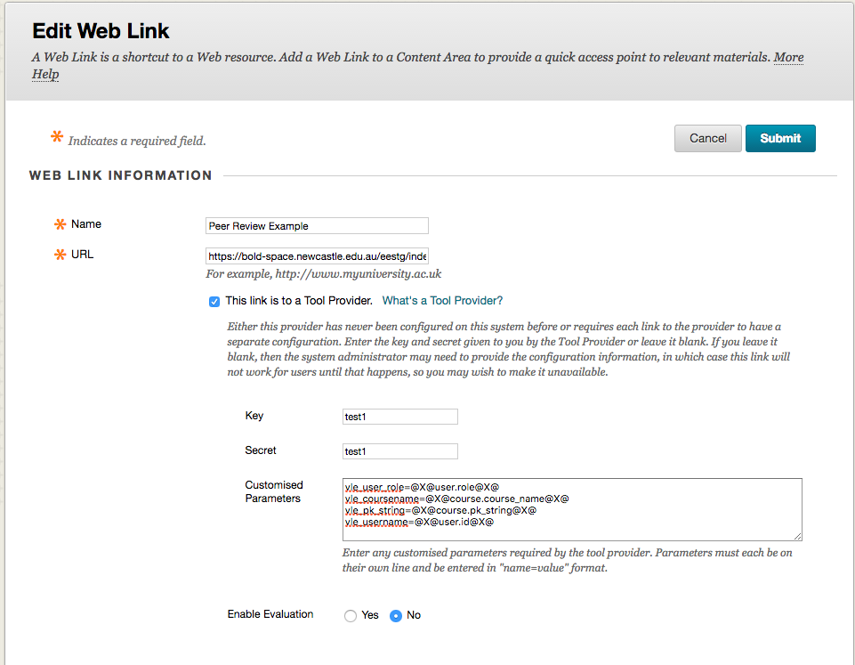
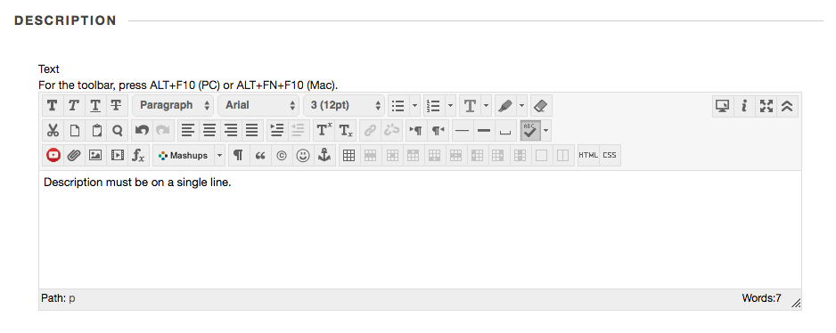
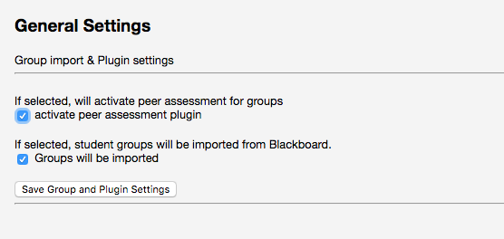
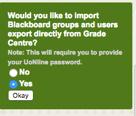
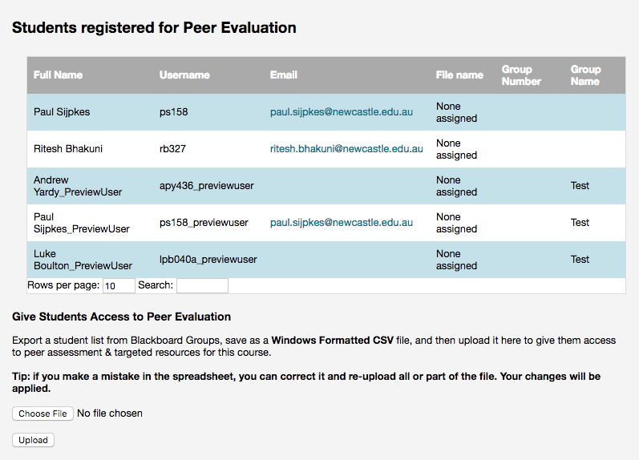
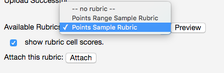

# Instructors

## Adding the LTI Link

Once the templates have been setup you will be supplied with the details for the LTI link as it appears in [Blackboard Learn](https://uonline.newcastle.edu.au/webapps/portal/execute/tabs/tabAction?tab_tab_group_id=_301_1)

## LTI Link Settings

Once the link has been placed in your course, you can manage settings as an Instructor by clicking the link.  To preview the tool, it is first necessary to [keep your preview user](http://en-us.help.blackboard.com/Learn/Instructor/Courses/Student_Preview#Keep_the_preview_user_and_data) and subsequently
[add your preview user to a group](https://www.blackboard.com/quicktutorials/bb9_groups_create_groups_add_students.htm).  Once in student preview, you will then see the group as a [student](Students).

### Blackboard Learn

* LTI link URL
* Key
* Secret
* Customised Parameters

#### Adding a Description (Single Line Only)

Note that there is a bug in blackboard that does not properly encode multi-line descriptions, so keep your description short and on a single line.

## Configuration

To configure the tool, access on the LTI link created earlier (ensure you are not in preview mode).

## Activate peer assessment
_This feature is primarily for developers and will be removed in future releases_

### Gradebook Syncronisation

The first time you use the tool a message will appear asking if you would like to automatically sync the gradebook. The gradebook is accessed in [Blackboard Learn via the Grade Center](http://en-us.help.blackboard.com/Learn/Instructor/Grade/Navigate_Grading). This will update the user list from the Gradebook every time you access the link. Select the appropriate option.  

### Manually Upload the Student Gradebook

If you choose 'No' for the above option, you will need to manually upload the student list.

To manually upload the student list, first download the [student list from group export](https://en-us.help.blackboard.com/Learn/Instructor/Interact/Course_Groups/080_Import_and_Export_Groups). Ensure you select the _Groups and group members_ and _Include header row_ options. The file will be emailed to you. You will need to download it from the link in the email.

In the instructor view, uploadt the csv file using the form.

## Add a Rubric ##

[Export a rubric from Blackboard Learn](https://en-us.help.blackboard.com/Learn/Instructor/Grade/Rubrics#Import_and_export_rubrics) that you would like the students to use to assess each other.

Upload the rubric ZIP file into the peer review tool using the form:

Select the rubric from the dropdown and Attach. You can use Preview to preview the Rubric.

_Rubrics will ***not*** attach automatically, ensure you click Attach._

## Configure Student View

There are several configuration options for the student view.

* Show grade column
    * _students can see the grade others have given them_
* Show comments
    * _students can see the comments others have given them_
* Turn on self assessment
    * _students assess their own performance first, they cannot assess others until they have assessed themselves_
      * **When changing this setting you will need to resync the user groups (see [Gradebook Syncronisation](#gradebook-syncronisation))**
* Include self in mean score
    * _mean score includes the student's own score, for example if there are 5 in the group and the total score the group has given the student is 300 the final score will be 300/5 = 60 rather than 300/4 = 75_
* Total maximum score for assessment
    * _used to calculate the percentage score, if you are not using a rubric you can set this here. The rubric total
      score will override this setting if a rubric is attached_

