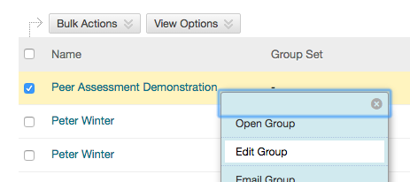

# Instructors

## Adding the LTI Link

Once the templates have been setup by the [Administrator](Administrators.md) you will be supplied with the details for the LTI link as it appears in [Blackboard Learn](https://uonline.newcastle.edu.au/webapps/portal/execute/tabs/tabAction?tab_tab_group_id=_301_1)

## LTI Link Settings

Once the link has been placed in your course, you can manage settings as an Instructor by clicking the link.  To preview the tool, it is first necessary to [keep your preview user](http://en-us.help.blackboard.com/Learn/Instructor/Courses/Student_Preview#Keep_the_preview_user_and_data) and subsequently
[add your preview user to a group](#previewing-as-a-student).  Once in student preview, you will then see the group as a [student](Students).

### Blackboard Learn

* LTI link URL
* Key
* Secret
* Customised Parameters


#### Adding a Description (Single Line Only)

Note that there is a bug in blackboard that does not properly encode multi-line descriptions, so keep your description short and on a single line.


## Previewing as a Student

You can see the student view by adding your Blackboard preview user to a group and then syncronising the PRP with Blackboard.

[View a general guide at blackboard.com on how to add users to groups](https://www.blackboard.com/quicktutorials/bb9_groups_create_groups_add_students.htm).

1.  Ensure you Save your preview user by accessing the   and then clicking the  button.
2.  Exit preview mode.
3. Access Users and Groups -> Groups.
4.  Select Edit Group in the drop down:
      

5.  Click **Add Users** and search for **Username -> Contains -> [your username]**.
      * Your username will be:
              **[your username] underscore preview user**,

        so the username ```jb123``` would have a preview user ```jb123_previewuser```

6. Depending on your setup you may need to [Manually Upload the Student Gradebook](Administrators.md#manually-upload-the-student-gradebook). The APEG will do this for you if correctly configured. If so, skip this step and continue to Step 7 otherwise speak to your [Administrator](Administrators.md).

7. You can now use preview mode to access the LTI link created earlier and view the peer review group you added your previewuser to in step 4 to 6 earlier.
