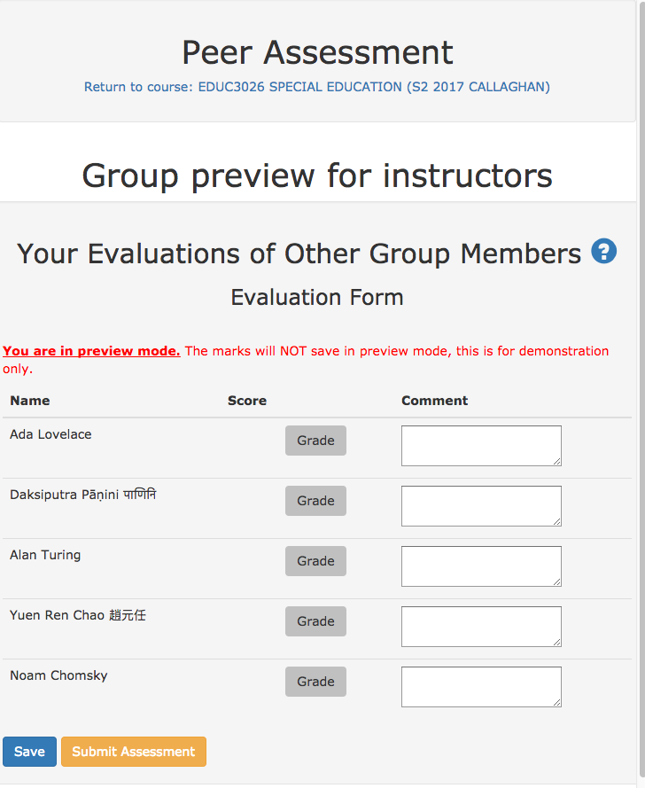
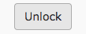
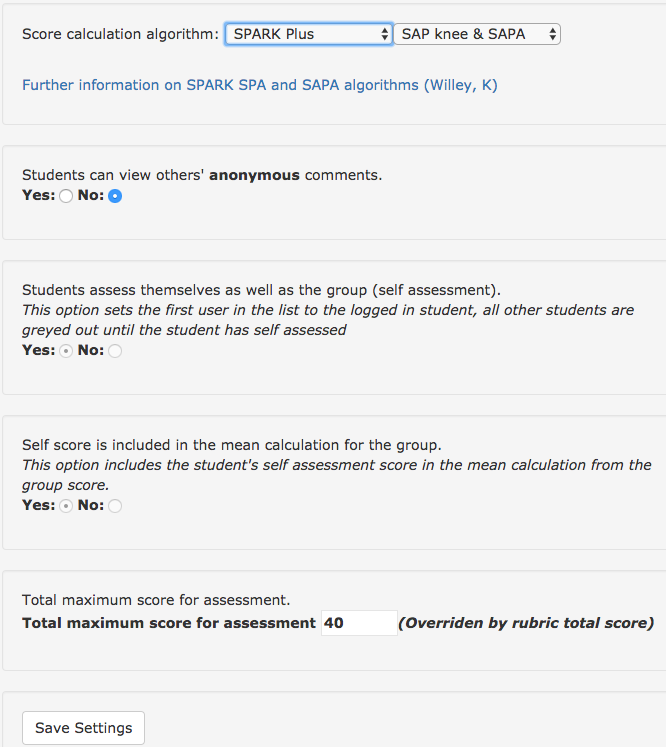

# Instructors

## Previewing as a Student

You can preview using [Student Preview](https://help.blackboard.com/Learn/Instructor/Courses/Student_Preview) in Blackboard. Clicking the link will then show you the Preview Group.  Note that the Preview Group will not save evaluations.

## Downloading Grades

Access the [LTI link you created earlier](Course-Builders/) scroll down to 'Download Evaluations' and click <button>Download</button>.  

## Clearing &amp; Unlocking Submissions

To unlock a student submission, find the students id in the table and click 'unlock'. 

## Changing Display Options

There are a number of display options for comments and algorithm type.

### Grading Algorithms

Currently the choice is between a standard Mean algorithm and SPARK's calculation algorithm, see the [home page](/) for information on each of these algorithms.

### Display options for comments and miscellaneous

These options are self explanatory, in the image below the total maximum score has been calculated based on the rubric.  This is done automagically when the rubric is imported to APEG.

