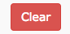

# Instructors

## Adding the LTI Link

Once the templates have been setup by the [Administrator](Administrators.md) you will be supplied with the details for the LTI link as it appears in [Blackboard Learn](https://uonline.newcastle.edu.au/webapps/portal/execute/tabs/tabAction?tab_tab_group_id=_301_1)

## LTI Link Settings

Once the link has been placed in your course, you can manage settings as an Instructor by clicking the link.  To preview the tool, it is first necessary to activate the [student preview](https://help.blackboard.com/Learn/Instructor/Courses/Student_Preview) in Blackboard.  Once in student preview, click the LTI link you created above.

### Blackboard Learn

* LTI link URL
* Key
* Secret
* Customised Parameters

#### Adding a Description (Single Line Only)

Note that there is a bug in blackboard that does not properly encode multi-line descriptions, so keep your description short and on a single line.

## Previewing as a Student

You can preview using [Student Preview](https://help.blackboard.com/Learn/Instructor/Courses/Student_Preview) in Blackboard. Clicking the link will then show you the Preview Group.  Note that the Preview Group will not save evaluations.

## Downloading Grades

Access the [LTI link you created earlier](http://localhost:8000/guides/Instructors/#adding-the-lti-link) scroll down to 'Download Evaluations' and select the option you prefer.  

_Use the CSV option if you're not getting the desired output in Excel_

## Clearing &amp; Unlocking Submissions

To unlock a student submission, find the students id in the table and click 'unlock'. 

To completely clear and remove a submission, click the  button next to the student's name.

## Changing Display Options

There are a number of display options for comments and algorithm type.

### Grading Algorithms

Currently the choice is between a standard Mean algorithm and SPARK's calculation algorithm, see the [home page](/) for information on each of these algorithms.

### Display options for comments and miscellaneous

These options are self explanatory, in the image below the total maximum score has been calculated based on the rubric.  This is done automagically when the rubric is imported to APEG.

