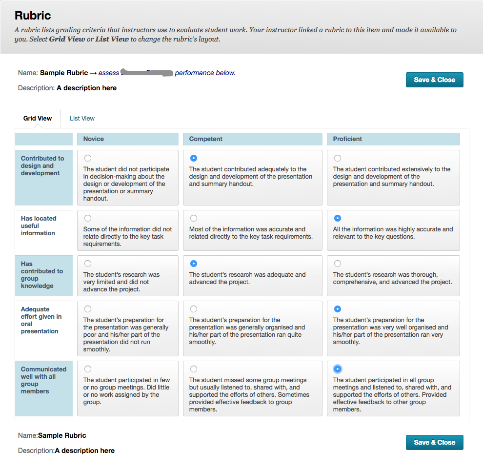
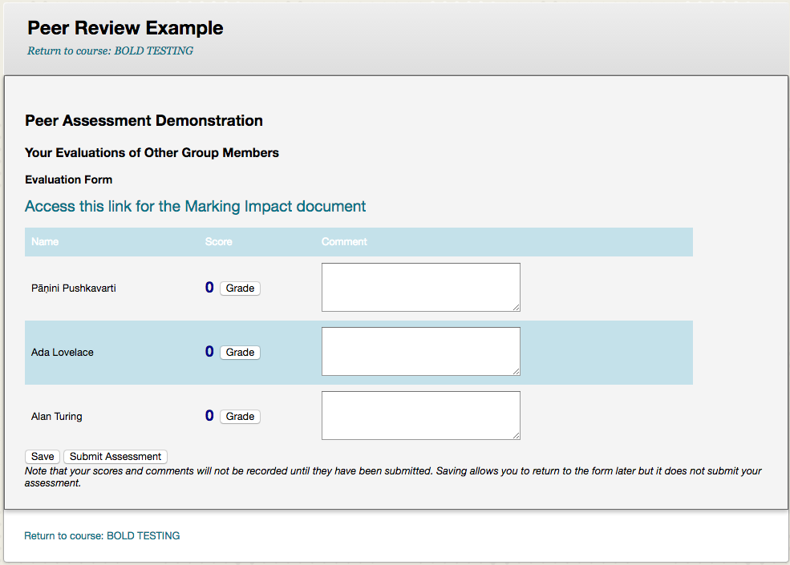

# Students

The instructor may elect to use a rubric or not, without a rubric the student view will look like [the top image](#no-rubric).  With the rubric a button will appear as in the [second image](#with-rubric).  Use the button to assess the other students.

If your instructor has self assessment turned on, the first person in the list will be yourself ([bottom image](#with-rubric-and-self-assess)).  You will not be able to evaluate other students until you have evaluated yourself.

## Save vs. Submit

* The **Save** button will allow you to save your submission and return to it later.

* The **Submit** button will submit the assessment and will not allow you to return to it.  However, if your instructor has rolling review turned on you will be able to continue submitting multiple reviews.

## No rubric
_Note that the wording and appearance of screenshots may vary depending on the course you are in_

_Step by Step Guide_

  1. Select the link in your course
  2. Enter a numeric grade in the text box next to each student's name
  3. Write a comment if required, otherwise add a hyphen '&ndash;' for the student in the comment box
  4. Repeat steps 1 to 6 for each person in your group
  5. Select Save if you want to come back later to change your evaluation
  6. Select Submit if you are ready to submit the assessment. 
  ***WARNING - you will not be able to undo step 6, so be sure of the evaluations you have provided.***

## With Rubric
_Note that the wording and appearance of screenshots may vary depending on the course you are in_

_Step by Step Guide_

  1. Select the link in your course
  2. Select the 'Grade' *or* 'Evaluate' button
  3. Select the radio button for each criterion
      
  4. Click *Save & Close*
  5. The student's score will appear next to their name
  6. Write a comment if required, otherwise add a hyphen '&ndash;' for the student in the comment box
  7. Repeat steps 1 to 6 for each person in your group
  8. Select Save if you want to come back later to change your evaluation
  9. Select Submit if you are ready to submit the assessment. 
  ***WARNING - you will not be able to undo step 9, so be sure of the evaluations you have provided.***

## With Rubric and Self-Assess
_Note that the wording and appearance of screenshots may vary depending on the course you are in_

_Step by Step Guide_

  1. Select the link in your course
  2. Select the 'Grade' *or* 'Evaluate' button next to your name
  3. Select the radio button for each criterion to *honestly* evaluate your own performance 
  **You will not be able to evaluate the other people in your group until you have evaluated yourself** 
  Now for each of the people in your group:
  4. Select the 'Grade' *or* 'Evaluate' button
  5. Select the radio button for each criterion
      
  6. Click *Save & Close*
  7. The student's score will appear next to their name
  8. Write a comment if required, otherwise add a hyphen '&ndash;' for the student in the comment box
  9. Repeat steps 4 to 6 for each person in your group
  10. Select Save if you want to come back later to change your evaluation
  11. Select Submit if you are ready to submit the assessment. 
  ***WARNING - you will not be able to undo step 9, so be sure of the evaluations you have provided.***

