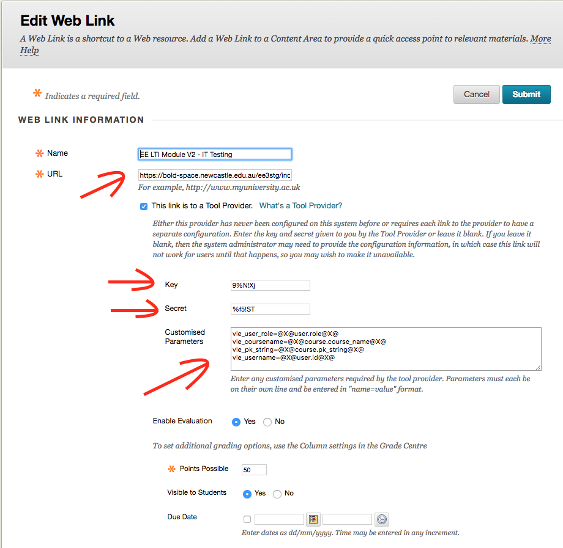
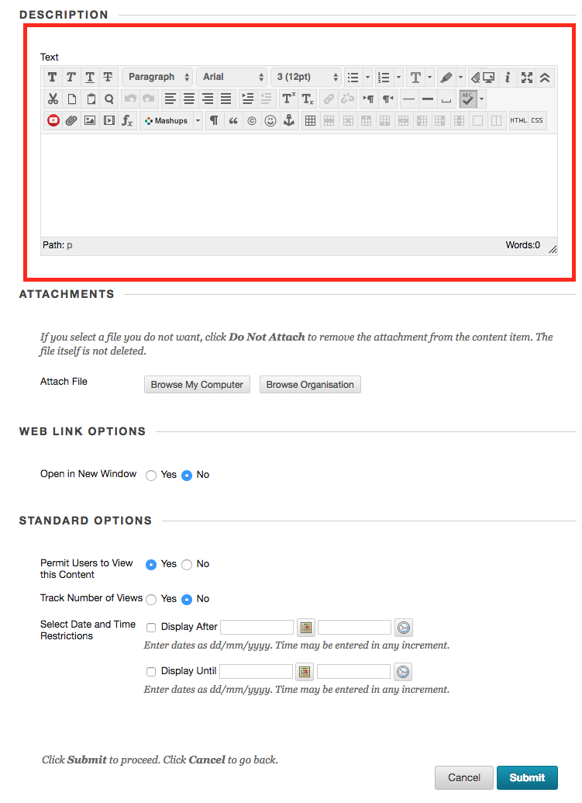

# Peer Review Platform

## What is it?

The peer review platform is a web based tool that allows students completing group work to evaluate each other's contribution to the group using a Blackboard Rubric or by giving a numeric 'grade'.  

## Setup for Instructors

Provided via an LTI link to the University of Newcastle's LMS, Blackboard Learn.
Contact the BOLD team to setup the tool for you.  You will be provided with the following information:

### LTI Link Settings in Blackboard Learn

* LTI link URL
* Key
* Secret
* Customised Parameters

### Adding a Description (Single Line Only)

Note that there is a bug in blackboard that does not properly encode multi-line descriptions, so keep your description short and on a single line.

## Commands

* `mkdocs new [dir-name]` - Create a new project.
* `mkdocs serve` - Start the live-reloading docs server.
* `mkdocs build` - Build the documentation site.
* `mkdocs help` - Print this help message.

## Project layout

    mkdocs.yml    # The configuration file.
    docs/
        index.md  # The documentation homepage.
        ...       # Other markdown pages, images and other files.

## Background

The peer review platform was developed at the University of Newcastle, Australia
